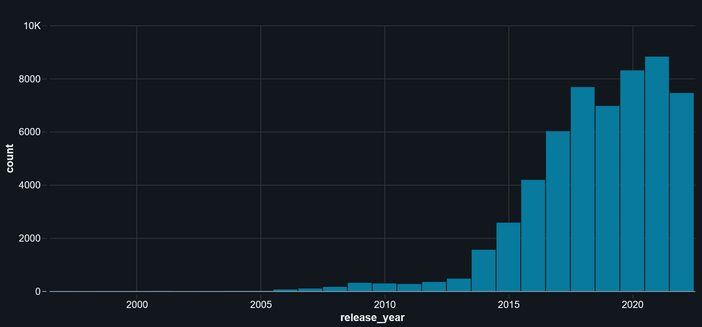
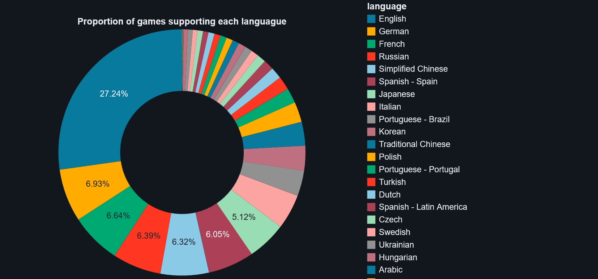

# Project Steam

lien github:
https://github.com/Sheikoh/Project_Steam.git

## Objective

This project aims at analysing data on games registered in the steam library. The observations are linked to the Publishers, Genres, Release date, ratings and so on. 

## Study

The study was performed using databricks to use the Spark framework and improve the response rate.

### Insights

**Number of releases per year**

Increase in the latest years, but drop with Covid.

**Most represented languages in games**

